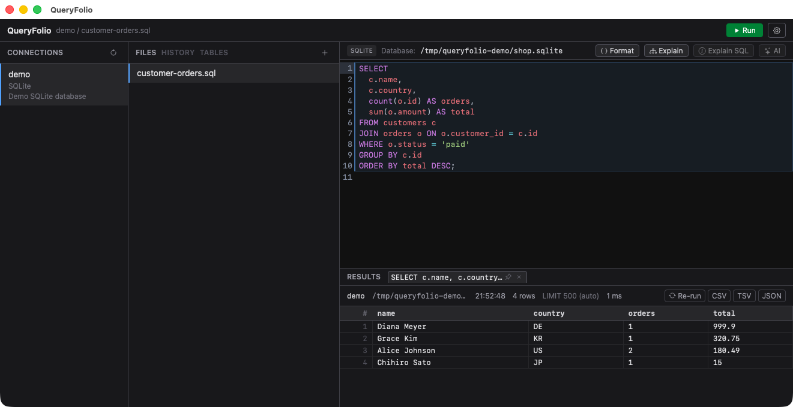

# QueryFolio

SQL client desktop app built with Tauri 2 + SvelteKit. A lightweight, multi-purpose SQL GUI client.

https://github.com/user-attachments/assets/90439816-49c8-4ebd-a068-b102cfe9c7aa



## Features

- MySQL / PostgreSQL / SQLite support (via sqlx)
- SSH tunnel with known_hosts verification
- Connection config in YAML, compatible with the sql-agent-mcp-server format
  - Secrets can stay in 1Password: the config YAML is fetched lazily via a getter command like `op read "op://..."`
- Query files per connection, auto-saved (`~/.config/queryfolio/sqlfiles/<folder>/*.sql`, where `<folder>` is `folder_name` or `<host>_<engine>_<schema>_<user>`)
- CodeMirror 6 SQL editor with per-engine dialect, statement highlighting, Cmd+Enter to run the statement under the cursor, and schema-based autocompletion (table / column names)
- SQL formatting for SELECT statements (conservative: unsupported or unparsable statements are left untouched)
- Schema browser (TABLES pane) with lazy-loaded columns
- Results in tabs with pinning, a cell inspector, and CSV / TSV / JSON copy (formula-injection safe)
- Query cancellation while running
- Per-connection query history (searchable, stored locally with restrictive file permissions)
- psql-style meta commands (`\l` `\dt` `\dv` `\dn` `\du` `\d [table]`) translated to catalog queries, with MySQL / SQLite equivalents where possible
- `\c <database>` switches the active database of the connection (MySQL / PostgreSQL). The pool is rebuilt, and the database selector, schema browser, and SQL completion follow
- `readonly: true` per connection rejects write statements (INSERT / UPDATE / DELETE / DDL, including CTE-wrapped DML) as a safety guard
- Auto `LIMIT` for SELECTs without one (`default_limit`, default 500)
- AI features (OpenAI): SQL generation from natural language, Fix with AI on query errors, EXPLAIN plan analysis with index suggestions, and explanation of selected SQL. Generated SQL is inserted into the editor, never auto-executed. Only the schema (table / column names), engine dialect, statements, and plans are sent — never query results
- Resizable panes: drag the dividers between the sidebars, editor, and results; sizes are persisted across restarts
- Window size / position restored across restarts
- Open a saved query file by path from a `queryfolio://open/<path>` URL or the `queryfolio open <path>` CLI subcommand (restricted to files under the query files directory; reuses the running window)

## Setup

```shell
pnpm install
pnpm tauri dev
```

## Configuration

Everything lives in one file: `~/.config/queryfolio/config.yml` (see `config.example.yaml`). Connections are written under `sql_servers`, and any key can be overridden from an external source with `config_override_command`:

> 📖 **See [docs/settings.md](docs/settings.md) for the full settings reference** — every key, SSH tunnel modes, groups, templates, `config_override_command`, AI, and more.

```yaml
# Inline (sql-agent-mcp-server compatible)
sql_servers:
  - name: dev-postgres
    engine: postgres
    host: localhost
    readonly: true   # optional: reject write statements on this connection
    ...

# Servers can be grouped for the connections list (queryfolio extension).
# Group entries and plain servers can be mixed; order is preserved.
# sql_servers:
#   - group_name: production
#     sql_servers:
#       - name: prod-main
#         ...
#   - name: ungrouped-db
#     ...

# Optional: run a command whose stdout is YAML, and merge it over this file.
# Mappings are merged recursively; scalars and lists (including sql_servers)
# are replaced wholesale. Any key can be overridden this way.
# config_override_command: op read "op://development/queryfolio/config-yaml"

# Optional
sqlfiles_dir: ~/queries
default_limit: 500   # auto-appended to SELECTs without LIMIT (0 = disabled)

# Optional: AI SQL generation (OpenAI)
ai:
  provider: openai   # only openai is supported for now
  api_key: sk-your-api-key
  model: gpt-5.1     # optional (default: gpt-5.1)
  base_url: https://api.openai.com/v1  # optional (for OpenAI-compatible APIs)
```

The `ai:` section can live at the top level of the local config file, or at the top level of the YAML fetched by `config_override_command`. The fetched YAML wins (that is just the merge result) — so the API key can stay in 1Password together with the connection secrets.

The `QUERYFOLIO_CONFIG_YAML` environment variable overrides the whole config file (for development; GUI apps launched from Finder do not inherit shell env vars).

## Opening files by URL / CLI

A saved query file can be opened by path, from either a URL scheme or a CLI subcommand. Both go through the same router and reuse the already-running window.

```shell
# URL scheme (absolute path; the leading slash of the path doubles the slash after the scheme)
open "queryfolio://open//Users/me/.config/queryfolio/sqlfiles/reporting/monthly.sql"

# CLI subcommand
queryfolio open /Users/me/.config/queryfolio/sqlfiles/reporting/monthly.sql
```

Only files directly under a connection folder inside the query files directory (`sqlfiles_dir`) can be opened. Paths outside that directory, unknown folders, non-`.sql` files, and `..` traversal are rejected. The connection that owns the folder is selected automatically and the file is opened in a new editor tab.

## Development

```shell
pnpm check                   # svelte-check
cd src-tauri && cargo test   # Rust unit tests
pnpm tauri build             # release build (macOS: signed with Developer ID via the tauri script)
```

See `AGENTS.md` for architecture details.

## Download

Grab the latest installer from the [Releases page](https://github.com/ytyng/queryfolio/releases/latest):

- **macOS**: `QueryFolio_<version>_universal.dmg` (Apple Silicon + Intel). Signed with a
  Developer ID certificate and notarized by Apple, so it opens without a Gatekeeper warning.
- **Windows**: `QueryFolio_<version>_x64-setup.exe` (NSIS installer). It is *not* code signed,
  so SmartScreen shows "Windows protected your PC" — choose **More info › Run anyway**.

## Release

Releases are built on GitHub Actions (`.github/workflows/release.yml`, manual trigger only)
and published as a GitHub Release. Bump the version and kick off the build with one command:

```shell
pnpm release                 # 0.1.0 -> 0.1.1 (patch)
pnpm release minor           # 0.1.0 -> 0.2.0
pnpm release major           # 0.1.0 -> 1.0.0
fab release                  # same thing via Fabric (fab release:minor / fab release:major)
fab -l                       # list all tasks (dev / check / unittest / build_local / release / releases)
```

The script requires a clean `main` in sync with `origin/main`. It bumps the version in
`src-tauri/tauri.conf.json` and `package.json`, pushes the bump commit, dispatches the
workflow, and follows the run. The workflow builds the macOS universal dmg (Developer ID
signed + notarized + stapled) and the Windows NSIS installer in parallel, uploads both to a
**draft** Release, and publishes it only after every platform succeeded (a missing signing
secret fails the macOS job up front, so an unsigned or un-notarized build is never
published). See the `publish-macos-release` skill (`.claude/skills/publish-macos-release/`)
for the full runbook, including how to verify the published dmg and the one-time
signing-secrets setup.

## License

MIT
